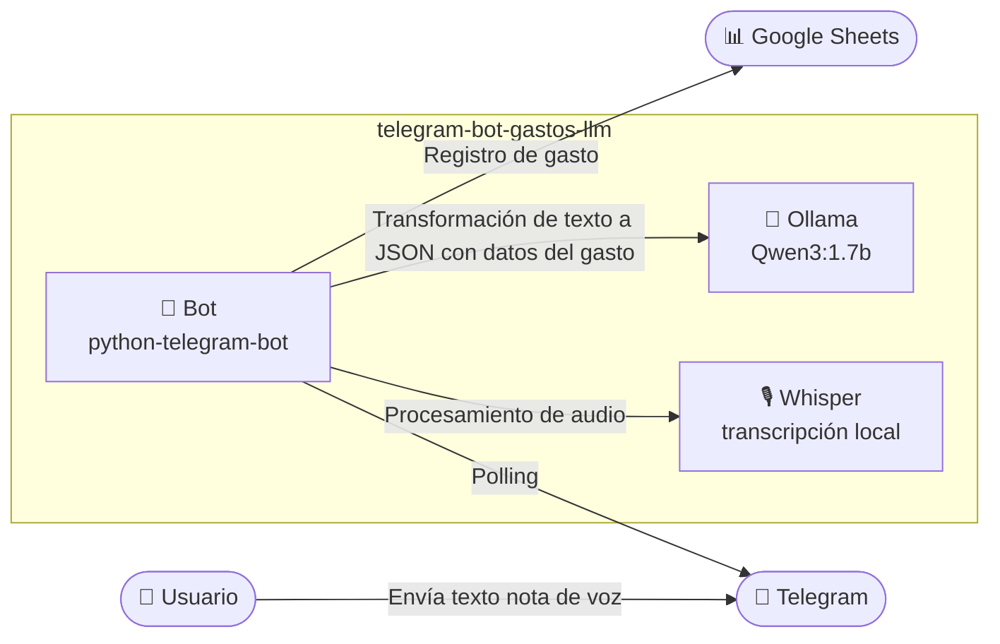
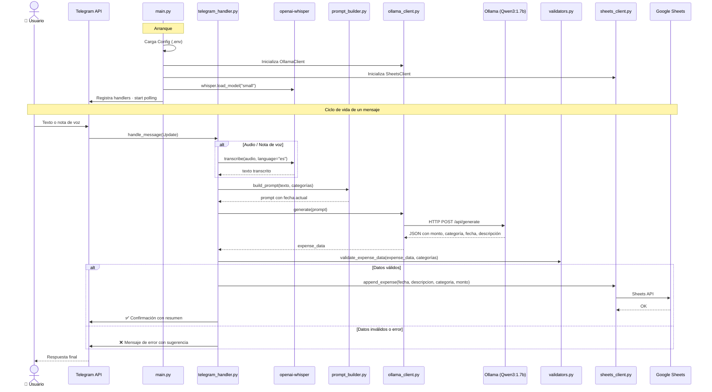

# Bot de Telegram para Registro de Gastos

Bot de Telegram que procesa mensajes de texto y audio en lenguaje natural sobre gastos y los registra automáticamente en Google Sheets usando un LLM local (Ollama).

## 🌟 Características

- 🤖 **Procesa lenguaje natural**: Envía mensajes como "Compré pan por $500 ayer" y el bot entiende
- 🎙️ **Soporte de audio**: Envía notas de voz o audios; el bot los transcribe automáticamente con Whisper (OpenAI)
- 📊 **Registro automático**: Guarda directamente en Google Sheets con descripción generada por el LLM
- 🧠 **LLM local**: Usa Qwen3:1.7B corriendo en Ollama (privado, sin costos de API)
- ⚙️ **Configurable**: Todo parametrizable vía variables de entorno
- 🍓 **Optimizado para Raspberry Pi**: Bajo consumo de recursos

## 🏗️ Arquitectura

### Diagrama de Contenedores (C2)

Vista de alto nivel de los componentes del sistema y cómo se comunican entre sí:



### Diagrama de Secuencia

Flujo detallado de inicialización y ciclo de vida de un mensaje:



## 📋 Requisitos Previos

1. **Python 3.9+**
2. **Ollama** instalado con modelo `qwen3:1.7b`
3. **Google Cloud** cuenta con Sheets API habilitada
4. **Bot de Telegram** creado via @BotFather
5. **ffmpeg** instalado en el sistema (requerido por Whisper para procesar audio)
6. **uv** package manager (opcional pero recomendado)

## 🚀 Instalación

### 1. Clonar/Copiar el Proyecto

Clonar repositorio

### 2. Instalar Dependencias

#### Usando uv (recomendado)

```bash
cd telegram-bot-gastos-llm

# Instalar uv si no lo tienes
curl -LsSf https://astral.sh/uv/install.sh | sh

# Crear virtual environment
uv venv

# Activar venv
source .venv/bin/activate

# Instalar dependencias
uv pip install -e .
```

#### Usando pip

```bash
cd telegram-bot-gastos-llm
python3 -m venv .venv
source .venv/bin/activate
pip install -e .
```

### 3. Configurar Ollama

```bash
# Verificar que Ollama está corriendo
ollama list

# Si no está el modelo, descargarlo
ollama pull qwen3:1.7b

# Probar el modelo
ollama run qwen3:1.7b "Hola"
```

## ⚙️ Configuración

### 1. Crear Bot de Telegram

1. Abre Telegram y busca **@BotFather**
2. Envía `/newbot`
3. Sigue las instrucciones (elige nombre y username)
4. **Copia el token** que te da BotFather

### 2. Configurar Google Sheets API

1. Ve a [Google Cloud Console](https://console.cloud.google.com/)
2. Crea un proyecto nuevo o selecciona uno existente
3. Habilita la **Google Sheets API** y **Google Drive API**
4. Crea una **Service Account**:
   - Ve a "IAM & Admin" → "Service Accounts"
   - Crea nueva service account
   - Descarga el archivo JSON de credenciales
5. **Comparte tu Google Sheet** con el email de la service account (con permisos de editor)
6. Copia el **Spreadsheet ID** de la URL:
   ```
   https://docs.google.com/spreadsheets/d/{SPREADSHEET_ID}/edit
   ```

### 3. Preparar Google Sheet

Tu hoja debe tener las siguientes columnas (en este orden):

| Fecha | Descripción | Categoría | Monto |
|-------|-------------|-----------|-------|

### 4. Configurar Variables de Entorno

```bash
# Copiar template
cp .env.example .env

# Editar con tus valores
nano .env
```

Completa las siguientes variables:

```bash
# Token del bot de Telegram (de @BotFather)
TELEGRAM_BOT_TOKEN=123456789:ABCdefGHIjklMNOpqrsTUVwxyz

# Modelo de Ollama
OLLAMA_MODEL=qwen3:1.7b
OLLAMA_TIMEOUT=45

# Google Sheets (ajusta las rutas)
GOOGLE_CREDENTIALS_PATH=/ruta/a/tu/service-account.json
SPREADSHEET_ID=tu-spreadsheet-id-aqui
SHEET_NAME=Gastos

# Categorías (personaliza según tus necesidades)
EXPENSE_CATEGORIES=Supermercado,Salidas,Juntadas,Compras

# Logging
LOG_LEVEL=INFO

# Directorio de logs (default: logs/ relativo al directorio de ejecución)
# En producción: /var/log/telegram-bot-gastos-llm
LOG_DIR=logs
```

## 🎯 Uso

### Modo Desarrollo (Consola)

```bash
# Activar venv si no está activado
source .venv/bin/activate

# Ejecutar bot
python run.py
```

### Comandos del Bot

- `/start` - Iniciar bot y ver mensaje de bienvenida
- `/help` - Ver categorías disponibles e instrucciones
- **Mensaje de texto** - Registrar un gasto escribiendo
- **Nota de voz / Audio** - Registrar un gasto por voz (Whisper transcribe automáticamente)

### Ejemplos de Mensajes

```
Compré pan por $500 ayer
Gasté 1200 en suplementos
Salida con amigos, 3500 pesos anteayer
Super hoy 2500
Juntada el lunes pasado, 1800
```

También podés enviar una nota de voz diciendo lo mismo y el bot la transcribirá antes de procesarla.

El bot entiende:
- ✅ Montos en diferentes formatos
- ✅ Referencias temporales (ayer, anteayer, hoy, etc.)
- ✅ Diferentes formas de expresar gastos
- ✅ Mensajes de texto y notas de voz / audios

## 🐳 Deployment en Raspberry Pi

### Como Servicio systemd

```bash
# 1. Crear directorio de logs
sudo mkdir -p /var/log/telegram-bot-gastos-llm

# 2. Copiar servicio
sudo cp systemd/telegram-bot-gastos-llm.service.template /etc/systemd/system/telegram-bot-gastos-llm.service

# 3. Editar si es necesario (ajustar User, WorkingDirectory)
sudo nano /etc/systemd/system/telegram-bot-gastos-llm.service

# 4. Recargar systemd
sudo systemctl daemon-reload

# 5. Habilitar inicio automático
sudo systemctl enable telegram-bot-gastos-llm

# 6. Arrancar servicio
sudo systemctl start telegram-bot-gastos-llm

# 7. Ver estado
sudo systemctl status telegram-bot-gastos-llm

# 8. Ver logs en tiempo real
sudo journalctl -u telegram-bot-gastos-llm -f
```

### Comandos Útiles

```bash
# Reiniciar servicio
sudo systemctl restart telegram-bot-gastos-llm

# Detener servicio
sudo systemctl stop telegram-bot-gastos-llm

# Ver últimas líneas de log
sudo journalctl -u telegram-bot-gastos-llm -n 50

# Deshabilitar inicio automático
sudo systemctl disable telegram-bot-gastos-llm
```

## 🔧 Troubleshooting

### El bot no responde

1. Verifica que Ollama está corriendo:
   ```bash
   ollama list
   ```

2. Verifica logs del bot:
   ```bash
   sudo journalctl -u telegram-bot-gastos-llm -f
   ```

3. Verifica que el token de Telegram es correcto

### Error de Google Sheets

1. Verifica que compartiste la hoja con la service account
2. Verifica que el SPREADSHEET_ID es correcto
3. Verifica que la pestaña existe y tiene el nombre correcto
4. Verifica permisos del archivo de credenciales:
   ```bash
   chmod 600 /ruta/a/credentials.json
   ```

### Ollama no responde o es muy lento

1. En Raspberry Pi, el modelo puede tardar 10-20 segundos
2. Verifica que tienes suficiente RAM libre:
   ```bash
   free -h
   ```
3. Considera ajustar `OLLAMA_TIMEOUT` en `.env`

### Categoría no reconocida

El bot valida que las categorías sean las configuradas en `EXPENSE_CATEGORIES`. Si el LLM devuelve una categoría no válida, el bot lo rechazará. Asegúrate de que tus categorías estén bien escritas en `.env`.

### Error al procesar audio / nota de voz

1. Verifica que `ffmpeg` está instalado:
   ```bash
   ffmpeg -version
   ```
   Si no está, instalarlo:
   ```bash
   sudo apt install ffmpeg
   ```

2. El modelo `small` de Whisper se descarga automáticamente en el primer inicio (~460 MB). Asegúrate de tener conexión a internet y espacio en disco.

3. En Raspberry Pi, la transcripción puede tardar varios segundos dependiendo de la longitud del audio. Si es muy lento, considera usar el modelo `tiny` modificando el código en `src/main.py`:
   ```python
   model_transcribe = whisper.load_model("tiny")
   ```

## 📁 Estructura del Proyecto

```
telegram-bot-gastos-llm/
├── src/
│   ├── main.py                 # Entry point
│   ├── config.py               # Configuración
│   ├── bot/
│   │   └── telegram_handler.py # Handlers de Telegram
│   ├── llm/
│   │   ├── ollama_client.py    # Cliente Ollama
│   │   └── prompt_builder.py   # Constructor de prompts
│   ├── storage/
│   │   └── sheets_client.py    # Cliente Google Sheets
│   └── utils/
│       ├── logger.py           # Logging
│       ├── validators.py       # Validaciones
│       └── exceptions.py       # Excepciones
├── tests/                      # Tests
├── systemd/                    # Templates systemd
├── .env                        # Configuración (no commitear)
├── .env.example                # Template de configuración
├── pyproject.toml              # Dependencias
└── README.md                   # Esta documentación
```

## 🔒 Seguridad

- ❌ **Nunca commitees** el archivo `.env` o credenciales de Google
- ✅ Usa `.gitignore` para excluirlos automáticamente
- ✅ Permisos 600 para archivos sensibles:
  ```bash
  chmod 600 .env
  chmod 600 /ruta/a/credentials.json
  ```

## 📝 Licencia

Este proyecto es de código abierto. Úsalo y modifícalo como necesites.

## 🤝 Contribuciones

Las contribuciones son bienvenidas. Por favor abre un issue o pull request.
